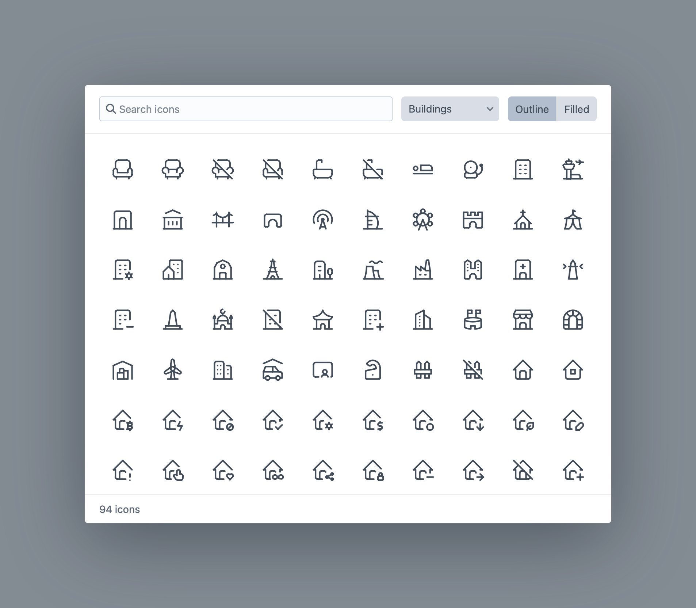

# Tabler Icons for Craft CMS

A field type for selecting a [Tabler icon](https://tabler.io/icons) from a searchable picker, and rendering any icon as inline SVG in your templates.

- 5,000+ outline icons and 1,000+ filled icons, bundled with the plugin
- Fast picker: search by name, tag, or category, outline/filled tabs, full keyboard navigation, and an optional random button
- Inline SVG rendering with custom attributes, plays nicely with Tailwind
- Site-wide rendering defaults via `config/tabler.php`
- `tabler()` Twig function for hardcoding icons without a field
- `|tabler` filter renders `{icon:name}` tokens in plain and rich text fields
- Use an icon field as an entry type’s Thumbnail Source
- Field setting to limit the picker to outline-only or filled-only icons

## Requirements

- Craft CMS 5.0+
- PHP 8.2+

## Installation

```bash
composer require bensomething/craft-tabler-icons
```

Or install from the control panel: **Settings → Plugins**.

### Package Size

The full Tabler icon set is bundled with the plugin, which makes it around 25MB on disk (roughly 4MB compressed for the actual download). In return, everything works offline. The picker, search, and SVG rendering make no CDN or API calls, icons can never change or disappear underneath your content, and front-end rendering is a local file read rather than an HTTP request.

## The Field

Create a field of type **Tabler Icon** and add it to a field layout. Authors get a **Choose** button that opens a searchable icon grid with a category filter; once an icon is selected, clicking its preview reopens the picker.

**Field settings** — *Icon Style* controls whether authors can pick from both styles, outline only, or filled only. Selecting **Outline and filled** will display **Outline** and **Filled** tabs in the icon picker.

## Templating

The field value is `null` or an Icon object:

```twig
{# Inline SVG at its native 24×24 #}
{{ entry.myIcon }}

{# With attributes — `size` sets width and height,
   `strokeWidth` is an alias for stroke-width (outline icons only) #}
{{ entry.myIcon.svg({ size: 32, class: 'text-red-500', strokeWidth: 1.5 }) }}

{# Guard against empty values #}

    {{ entry.myIcon.svg({ size: 20 }) }}


{# Properties #}
{{ entry.myIcon.name }}        {# "ad-off" #}
{{ entry.myIcon.label }}       {# "Ad Off" #}
{{ entry.myIcon.variant }}     {# "outline" or "filled" #}
```

Icons inherit `currentColor`, so they take the CSS text colour of their parent. SVGs render with `aria-hidden="true"` by default. Pass an `aria-label` for icons that carry meaning.

### Default Attributes

Set site-wide SVG defaults in a `config/tabler.php` file in your project:

```php
<?php

return [
    'svgDefaults' => [
        'class' => 'text-highlight',
        'stroke-width' => 1.5,
        'stroke-linecap' => 'square',
    ],
];
```

Every `svg()` call (and bare icon output) starts from these. Per-call attributes override defaults, except `class`, which is combined:

```twig
{{ item.icon.svg({ class: 'size-8 mb-2' }) }}   {# class="… text-highlight size-8 mb-2" stroke-width="1.5" … #}
{{ item.icon.svg({ strokeWidth: 2.5 }) }}       {# overrides the configured stroke-width #}
{{ item.icon.svg({ defaults: false }) }}        {# skips the configured defaults entirely #}
```

### Manual Icons (No Field)

The `tabler()` Twig function returns the same Icon object for any icon name:

```twig
{{ tabler('map-pin') }}
{{ tabler('map-pin').svg({ size: 20, class: 'list-icon' }) }}
{{ tabler('heart', 'filled').svg({ size: 20 }) }}
{{ tabler('heart-filled') }}   {# '-filled' suffix also selects the filled variant #}
```

`tabler()` also accepts an existing Icon object (e.g. a field value) and returns it unchanged, handy for partials that take either a name or a field value:

```twig
{{ tabler(item.myIcon ?? 'star').svg({ size: 20 }) }}
```

Unknown icon names render as an empty string.

### Icons in Plain and Rich Text Fields

The `tabler` filter replaces icon tokens in any HTML with inline SVG, handy for CKEditor fields:

```twig
{{ entry.body|tabler }}
```

Authors can type a token anywhere in their content (a `-filled` suffix works here too):

```
Call us {icon:phone} or {icon:heart-filled} us on social.
```

Icons are sized at `1em` and aligned to sit naturally in running text so they scale with the surrounding font size and inherit its color, and `svgDefaults` apply. Each is wrapped in `<span class="tabler-icon">` if you want a styling hook. Unknown icon names render as an empty string.

The filter works on any string, not just CKEditor fields — Plain Text fields, Table columns, even titles. One caveat: `|tabler` marks its output as safe HTML, which skips Craft’s usual escaping. That’s fine for already-purified rich text, but for plain-text values escape first. Tokens survive escaping, so this just works:

```twig
{{ entry.tagline|e|tabler }}
```

### With Tailwind

Skip `size` and use utility classes, CSS wins over the SVG's intrinsic `width`/`height` attributes:

```twig
{{ tabler('calendar').svg({ class: 'size-4 sm:size-6 shrink-0 text-emerald-600' }) }}
```

### GraphQL

You query the field by its handle, and each Tabler Icon field resolves to a shared `tabler_Icon` type with these subfields:

```graphql
{
  entries(section: "features") {
    ... on feature_Entry {
      myIcon {
        name            # "heart"
        variant         # "outline" or "filled"
        label           # "Heart (Filled)"
        classes         # "ti ti-heart-filled", for the Tabler webfont
        svg(size: 24)   # inline SVG markup, svgDefaults apply
      }
    }
  }
}
```

Empty fields resolve to `null`.

### Webfont Classes

If you load the Tabler webfont on the front end yourself, `classes()` gives you the class names:

```twig
<i class="{{ entry.myIcon.classes() }}"></i>   {# "ti ti-ad-off" / "ti ti-heart-filled" #}
```

## License

This plugin is MIT-licensed. Tabler Icons are © [Paweł Kuna](https://github.com/tabler/tabler-icons), also MIT-licensed (see `LICENSE-tabler`).



[](https://packagist.org/packages/bensomething/craft-tabler-icons)
[](https://packagist.org/packages/bensomething/craft-tabler-icons)
